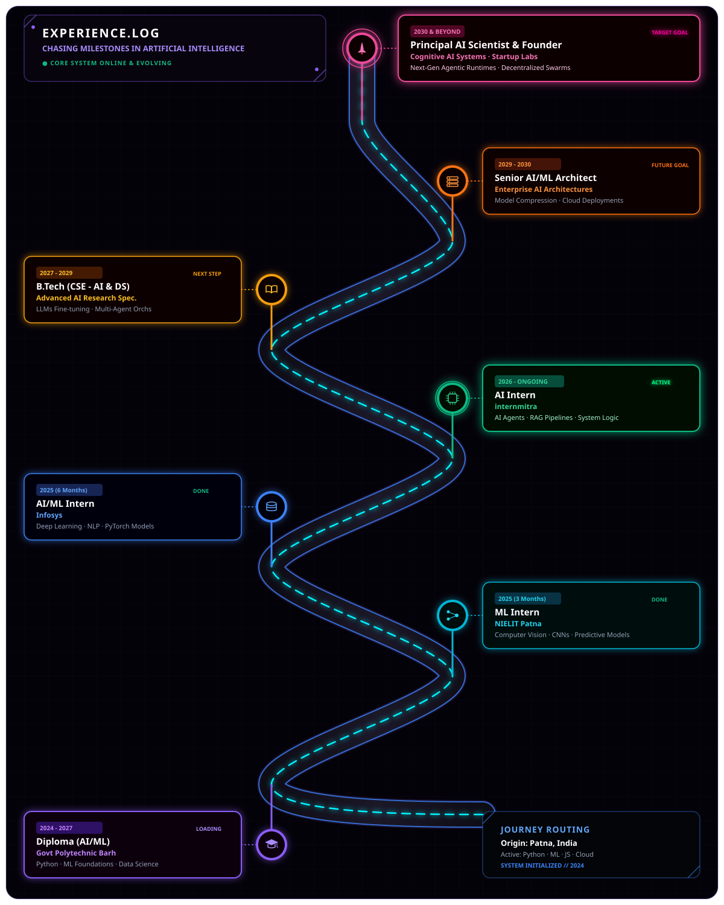

  

<picture>
  <source media="(prefers-color-scheme: dark)" srcset="https://capsule-render.vercel.app/api?type=waving&height=200&section=header&text=AMIT%20KUMAR&fontSize=70&fontAlignY=38&fontColor=a78bfa&desc=AI%20ENGINEER%20%E2%80%A2%20MACHINE%20LEARNING%20%E2%80%A2%20FULL%20STACK&descAlignY=62&descSize=16&color=gradient&customColorList=0,2,4&animation=fadeIn" />
  
</picture>

 

<picture>
  <source media="(prefers-color-scheme: dark)" srcset="https://readme-typing-svg.demolab.com?font=JetBrains+Mono&size=15&pause=1000&color=a78bfa&center=true&vCenter=true&width=600&lines=%E2%97%8F+ONLINE+%7C+PATNA%2C+INDIA+%7C+GOVT+POLYTECHNIC+BARH+%7C+2024+%E2%80%94+2027" />
  
</picture>

  

  

  <table bgcolor="#080710" border="0" cellspacing="0" cellpadding="24" width="100%">
    <tr>
      <td align="center" bgcolor="#080710">
        <b>⚡ TOTAL PROFILE VISITS ⚡</b>
          
        
        &nbsp;&nbsp;
        
      </td>
    </tr>
  </table>
   
  
<!-- CHAMGADAR PlayGround System Section -->
 

  

 

| 🚀 SYSTEM SIMULATORS | 🔍 DETECTORS & SCANS | 📡 SANDBOX ARENAS |
| :---: | :---: | :---: |
|  |  |  |
|  |  |  |

 

  

<picture>
  <source media="(prefers-color-scheme: dark)" srcset="https://activity-graph.vercel.app/graph?username=Amitkumar2801&bg_color=080710&color=a78bfa&line=8b5cf6&point=00ffcc&area=true&hide_border=true&title_color=a78bfa" />
  
</picture>

 

  
&nbsp;&nbsp;&nbsp;
&nbsp;&nbsp;&nbsp;

  

**ＬＡＮＧＵＡＧＥＳ** 
    

 

**ＡＩ · ＭＬ · ＤＡＴＡ** 
     

 

**ＷＥＢ · ＣＬＯＵＤ · ＴＯＯＬＳ** 
         

  

 

  

  

  

   

  

  
  &nbsp;
  &nbsp;
    
  &nbsp;
  &nbsp;
  

  

<code>AMIT KUMAR · AI ENGINEER · PATNA, INDIA · SYSTEM ONLINE</code>

